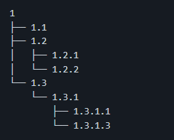
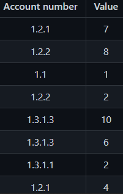
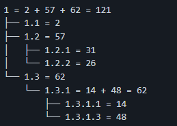

# DEEP-ESG-Data-Challenge
Data Processing Technical Challenge for Deep ESG

--
 

---

# Goal 
Considering the following structure of a chart of accounts with one root node (account 1):  
  
And the following example of a general ledger: 
  
The main goal of this challenge is to organize the Chart of Accounts given as input by adding each value addressed to a certain account number at the general ledger and sum these values to populate each line of the chart of accounts according to its number of identification, which is the same as the account number presented in the general ledger. 
Finally, we must make a final sum of all the values represented in each leaf of the chart of accounts that has a link to a certain node (01 to 05) and present the sum of values of each row of the chart, similar to the structure previously displayed at the images above, resulting in a consolidated chart of accounts similar to the one below: 

